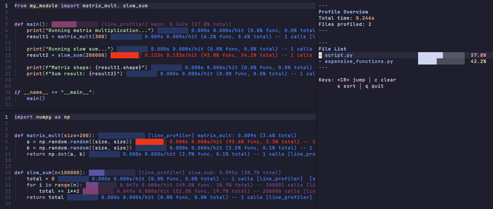

# python-profiler.nvim

Python code profiling & visualization for Neovim. (unstable; wip)




## Installation

### [lazy.nvim](https://github.com/folke/lazy.nvim)

```lua
return {
  "cyprienhm/python-profiler.nvim",
  opts = {},
}
```

## Usage

`:PythonProfileStart`
